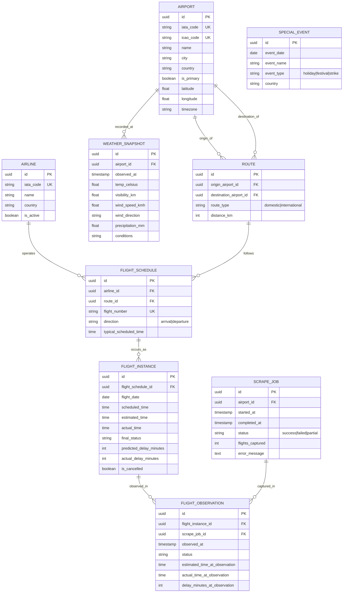

# Entity-Relationship Analysis
## Nepal Flight Delay Prediction - Data Modeling

---

## 1. Entity Identification

Based on the requirements, we identify the following entities:

| Entity | Description | Key Insight |
|--------|-------------|-------------|
| **Airport** | Physical airport location | Enables multi-airport support |
| **Airline** | Operating airline company | Master data, linked to flights |
| **Route** | Path between two airports | Allows route-based analysis |
| **FlightSchedule** | Recurring flight pattern | Flight number + typical times |
| **FlightInstance** | Single occurrence of a flight | One trip on one specific date |
| **FlightObservation** | Snapshot of flight at scrape time | Status history tracking |
| **WeatherSnapshot** | Weather at airport at time | ML feature source |
| **ScrapeJob** | Record of each scrape run | Operations/debugging |
| **SpecialEvent** | Holidays, festivals | Seasonal pattern feature |

---

## 2. ER Diagram



---

## 3. Key Design Decisions

### 3.1 Flight Uniqueness Strategy

```
┌─────────────────────────────────────────────────────────────┐
│                   FLIGHT IDENTITY CHAIN                      │
├─────────────────────────────────────────────────────────────┤
│                                                              │
│  FlightSchedule (Master Pattern)                            │
│  ├── flight_number: "BHA710"                                │
│  ├── airline: Buddha Air                                     │
│  ├── route: Biratnagar → Kathmandu                          │
│  └── typical_time: 17:00                                    │
│       │                                                      │
│       ├──▶ FlightInstance (2026-01-17)                      │
│       │    ├── scheduled: 17:00                              │
│       │    ├── actual: 18:26                                 │
│       │    └── delay: +86 minutes                           │
│       │                                                      │
│       ├──▶ FlightInstance (2026-01-17) ← Same day,          │
│       │    ├── scheduled: 20:00         different trip!     │
│       │    ├── actual: 20:15                                 │
│       │    └── delay: +15 minutes                           │
│       │                                                      │
│       └──▶ FlightInstance (2026-01-18)                      │
│            ├── scheduled: 17:00                              │
│            └── ...                                           │
│                                                              │
└─────────────────────────────────────────────────────────────┘
```

**Composite Unique Key for FlightInstance:**
```
(flight_schedule_id, flight_date, scheduled_time)
```

### 3.2 Status Observation Pattern

Each scrape creates observations only when something changes:

```
Scrape 1 (16:30): BHA710 - Status: "On Time", Estimated: 17:00
Scrape 2 (17:00): BHA710 - Status: "Delayed", Estimated: 17:45  ← New observation
Scrape 3 (17:30): BHA710 - Status: "Delayed", Estimated: 17:45  ← Skip (no change)
Scrape 4 (18:00): BHA710 - Status: "Delayed", Estimated: 18:20  ← New observation
Scrape 5 (18:30): BHA710 - Status: "Landed", Actual: 18:26      ← New observation
```

### 3.3 Delay Types in Model

| Field | Location | Calculation | When Updated |
|-------|----------|-------------|--------------|
| `delay_minutes_at_observation` | FlightObservation | estimated - scheduled | Each scrape |
| `predicted_delay_minutes` | FlightInstance | Latest estimated - scheduled | Each scrape |
| `actual_delay_minutes` | FlightInstance | actual - scheduled | On completion |

---

## 4. Relationships Summary

| Parent | Child | Cardinality | Description |
|--------|-------|-------------|-------------|
| Airport | Route | 1:N | Airport can be origin of many routes |
| Airport | WeatherSnapshot | 1:N | Many weather readings per airport |
| Airline | FlightSchedule | 1:N | Airline operates many schedules |
| Route | FlightSchedule | 1:N | Route can have multiple flights |
| FlightSchedule | FlightInstance | 1:N | Schedule has many daily instances |
| FlightInstance | FlightObservation | 1:N | Instance observed multiple times |
| ScrapeJob | FlightObservation | 1:N | One scrape captures many flights |

---

## 5. Normalization Benefits

- **1NF**: All attributes atomic (no arrays in cells)
- **2NF**: No partial dependencies (all non-key attributes depend on full PK)
- **3NF**: No transitive dependencies (route_type derived from airports, stored for query speed)

This design allows:
- Tracking a flight across its entire lifecycle
- Analyzing patterns by airline, route, time of day
- Correlating delays with weather
- Easy ML feature extraction with SQL queries
